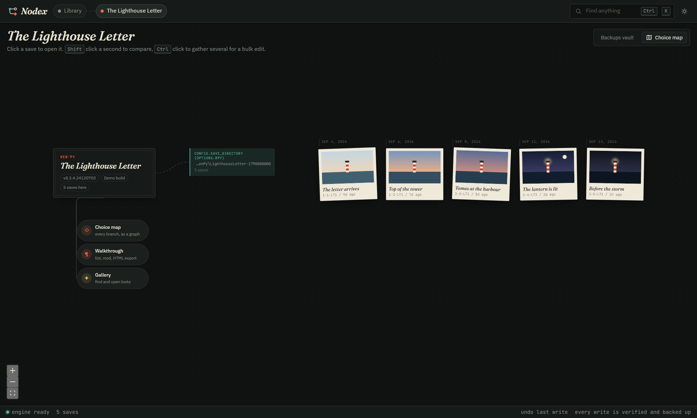
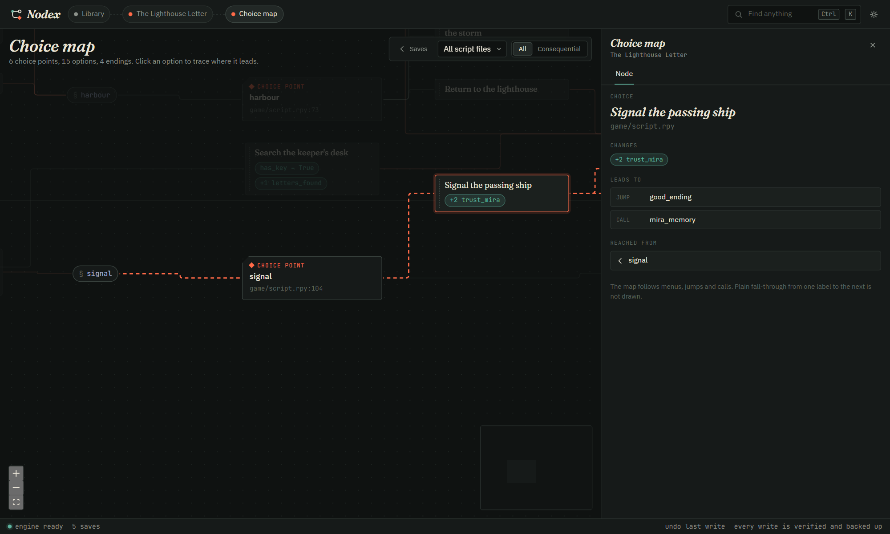
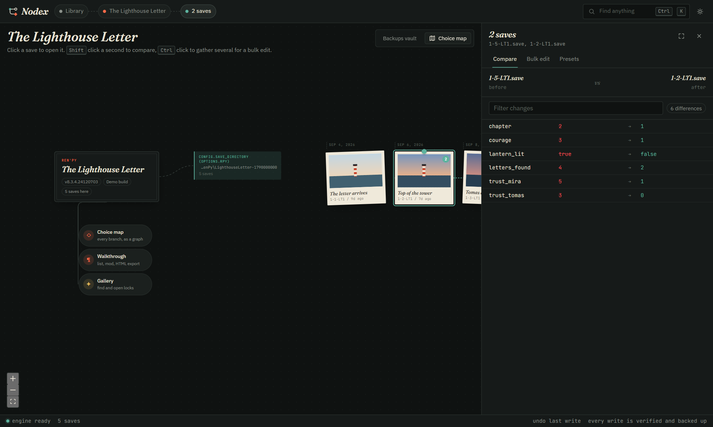
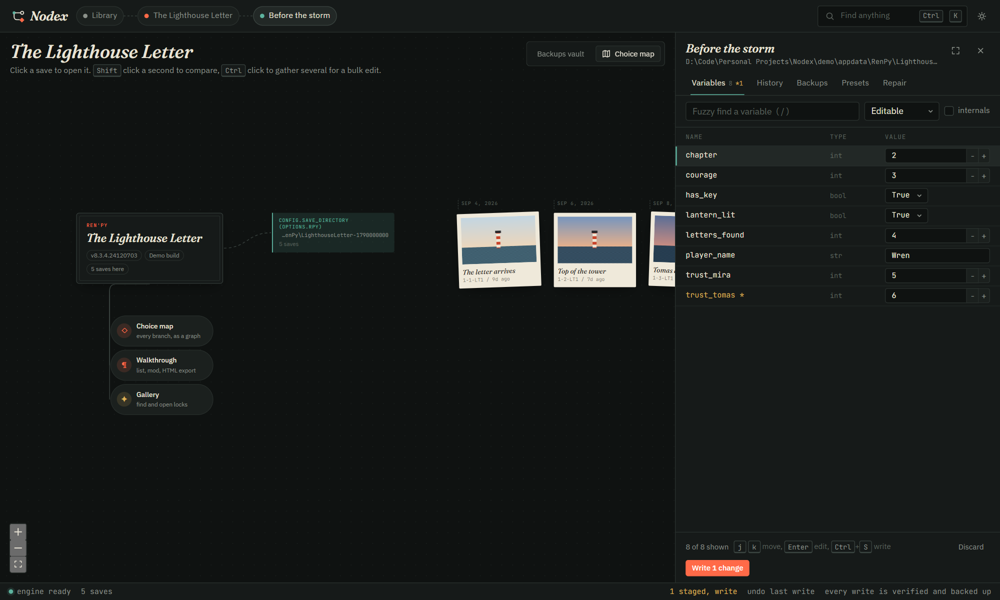
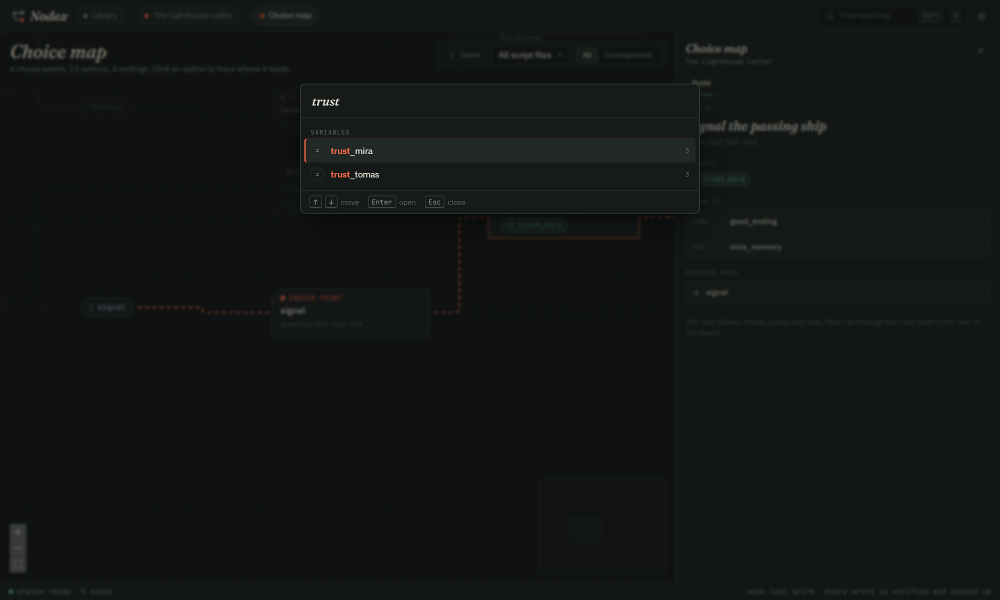
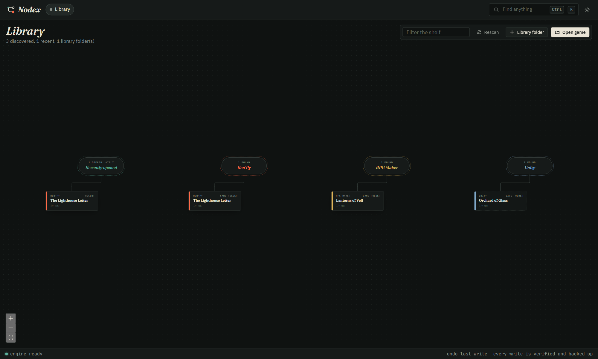
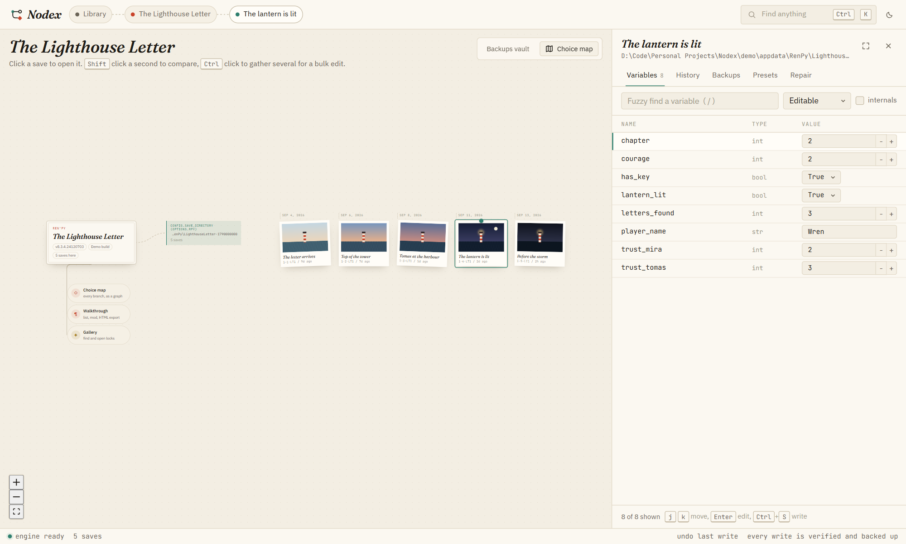
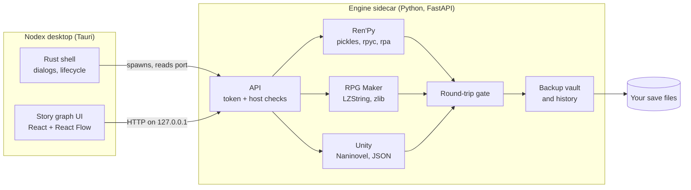

<div align="center">


# Nodex

**A story graph for visual novel saves.**
Edit variables, repair corrupted saves, compare playthroughs, map every choice, and unlock galleries,
for Ren'Py, RPG Maker MV/MZ and Unity games. Entirely on your own machine.

[](https://github.com/Abudora-0/Nodex/actions/workflows/ci.yml)
[](https://github.com/Abudora-0/Nodex/releases)
[](LICENSE)


[](https://nodexx.vercel.app)

**[Website](https://nodexx.vercel.app)** · **[Download](https://github.com/Abudora-0/Nodex/releases/latest)** · **[Engine notes](docs/engines.md)**



</div>

## Why Nodex

Save editors usually show you a flat list of values and hope for the best. Nodex treats a game as what it is: a
branching story with saves pinned along it. You move through a canvas of games, saves and choices, and every
change you make is checked by reading the file back before anything touches your disk.

- **Nothing is written unless it survives a round trip.** Every edit is unpickled, re-encoded, reloaded and
  compared structurally. If anything differs, the write is refused and your file is left alone.
- **Every overwrite is backed up first**, into a timestamped vault, and every write is recorded in a history you
  can undo from.
- **No uploads, no telemetry.** Nodex reads the game folders you already have and never sends them anywhere.

## Features

<table>
<tr>
<td width="50%" valign="top">

### Library
Nodex scans the places games keep saves on this machine (`%APPDATA%/RenPy`, `AppData/LocalLow`) plus any
folders you add, and lays them out by engine. Recently opened games sit up front.

### Saves as a timeline
Each save becomes a card with its own screenshot, ordered by when it was made. Click to open, <kbd>Shift</kbd>
click a second to compare, <kbd>Ctrl</kbd> click several for a bulk edit.

### Variable editor built for thousands of rows
A virtualized grid with fuzzy search, typed editors (steppers for numbers, themed dropdowns for booleans),
keyboard navigation (<kbd>j</kbd> <kbd>k</kbd> <kbd>Enter</kbd> <kbd>Ctrl</kbd>+<kbd>S</kbd>) and a focus mode
that gives the grid the whole window.

</td>
<td width="50%" valign="top">

### Choice map
Every menu in a Ren'Py game, drawn as a graph of labels, choice points, options and endings. Click an option to
trace where it leads and how you got there. Effects link straight to the variable in your open save.

### Compare, bulk edit, presets, undo
Diff two saves or a save against any of its backups. Apply the same change to many saves at once, with a dry run
first. Save named presets like "max affection" and reuse them. Undo any write, including whole batches.

### Command palette
<kbd>Ctrl</kbd>+<kbd>K</kbd> finds games, saves, variables, labels and commands, or opens any folder path you
paste.

### Repair, walkthroughs, galleries
Diagnose and rebuild corrupted Ren'Py saves, install an in-game walkthrough mod or export a standalone HTML guide,
and unlock gallery flags safely (collections are filled, never overwritten).

</td>
</tr>
</table>

<details>
<summary><b>More screenshots</b></summary>
<br />

| Choice map | Compare two saves |
| --- | --- |
|  |  |
| **Variable editor** | **Command palette** |
|  |  |
| **Library** | **Paper theme** |
|  |  |

All screenshots use the bundled demo library (see [Try it without any games](#try-it-without-any-games)).

</details>

## Supported engines

| Engine | Formats | Edit | Compare | Repair | Choice map | Gallery |
| --- | --- | :---: | :---: | :---: | :---: | :---: |
| **Ren'Py** 7 and 8 | `.save`, `persistent`, `.rpyc`, `.rpa` | Yes | Yes | Yes | Yes | Yes |
| **RPG Maker** MV and MZ | `.rpgsave`, `.rmmzsave` | Yes | Yes | | | |
| **Unity** (Naninovel, plain JSON) | `.nson`, `.json`, `.savefile`, `.dat` | Yes | Yes | | | |

Encrypted Unity saves (for example Easy Save 3 with a per-game password) are detected and reported, not guessed at.

Measured against a real local library: every Ren'Py save (1,406 files), RPG Maker save (833) and openable Unity
save (130) round-trips cleanly, and 1,013 menus were mapped across 10 installed games.

## Install

### Desktop app (Windows)

Download the `.msi` or the setup `.exe` from [the website](https://nodexx.vercel.app) or [Releases](https://github.com/Abudora-0/Nodex/releases) and run it.
The app bundles its own engine; no Python or Node is needed.

### From source

Requirements: Python 3.11+, Node 20+.

```bash
# engine (http://127.0.0.1:8765)
cd backend
pip install -e ".[dev]"
python -m nodex

# interface (http://localhost:5173), in a second terminal
cd frontend
npm install
npm run dev
```

Open <http://localhost:5173>, then open a game folder or add the folder where you keep your games.

### Try it without any games

```bash
python scripts/make_demo.py demo
cd frontend && npm run build && cd ..
python scripts/serve_demo.py demo
```

Then open <http://127.0.0.1:8766>. The demo is an original, generated library (a Ren'Py game with compiled scripts,
an RPG Maker game and a Unity save folder) that runs isolated from your real saves and settings.

## Building the desktop app

Nodex ships as a [Tauri 2](https://tauri.app) app. The Python engine is frozen with PyInstaller and launched as a
sidecar; the window talks to it over loopback with a per-launch token.

Prerequisites on Windows:

```bash
winget install Rustlang.Rustup
rustup default stable-msvc
winget install Microsoft.VisualStudio.2022.BuildTools
```

Install the "Desktop development with C++" workload when the Build Tools installer opens. WebView2 already ships
with Windows 11.

Then build the installers:

```bash
powershell -ExecutionPolicy Bypass -File scripts/build-desktop.ps1
```

Installers land in `frontend/src-tauri/target/release/bundle/`. Pushing a `v*` tag runs the same build in GitHub
Actions and attaches the installers to a draft release.

## How it works



The engine never loads a game's own code. Ren'Py saves are pickles of live game objects, so Nodex synthesises
stand-in classes, records where each came from, and writes them back under their original names. Choice maps are
read from the compiled AST rather than by decompiling. The full write-up of each format, including the bugs that
shaped the design, is in [docs/engines.md](docs/engines.md).

### Project layout

```
backend/
  nodex/core/          engine detection, atomic writes, backup vault, app state
  nodex/engines/       renpy/, rpgmaker/, unity/ format readers and writers
  nodex/api/           FastAPI app, shared edit path, routes (library, backups, history, graph)
  packaging/           PyInstaller spec for the desktop sidecar
  tests/               fixtures are generated; no games required
frontend/
  src/graph/           canvas worlds: library, game, choice map
  src/inspector/       dock panes: variables, compare, bulk edit, presets, backups, repair
  src/palette/         command palette
  src-tauri/           desktop shell
scripts/               demo library, desktop build, em dash check
docs/                  engine notes and screenshots
```

## Development

```bash
cd backend
python -m pytest tests -q            # fast, builds its own fixtures
python tools/corpus_check.py         # round-trips every Ren'Py save on this machine
python tools/analyze_check.py        # maps choices in every installed game
python tools/rpg_corpus_check.py     # RPG Maker saves
python tools/unity_corpus_check.py   # Unity saves under AppData/LocalLow
```

The corpus tools read your own library and are the main correctness signal for the save layers. CI runs the test
suite, a frontend type check and build, and `scripts/check_dashes.py`, which keeps em dashes out of the codebase.

## Contributing

Issues and pull requests are welcome. For a new save format, please include a generated fixture in the tests
rather than a real save file, and make sure the round-trip gate covers it.

## Disclaimer

Nodex is for your own saves and games you own. It does not redistribute game files, and it is not affiliated with
Ren'Py, RPG Maker, Unity or Naninovel.

## License

[MIT](LICENSE)
